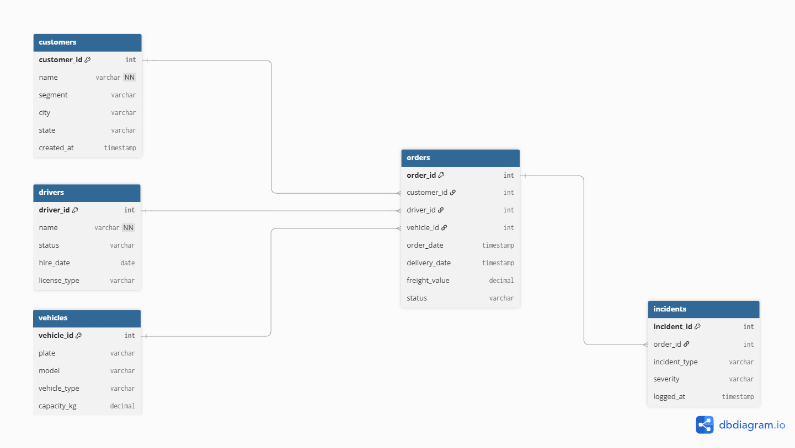

# Operations-Analytics - SQL Data Model & Logistics Analysis

## Tech Stack

* **Database:** PostgreSQL
* **Tooling** pgAdmin 4 / DBeaver, VS Code
* **Version Control** Git & GitHub

## Data Architecture
the database schema consists of 5 core tables:
* `customers`: Customer profiles and registration details.
* `drivers` : Driver information and status.
* `vehicles` : Vehicle fleet specificarions and capacity.
* `orders` : Freight orders containing shipping dates, costs, and delivery statuses.
* `incidents` : Delivery incidents, delays, and exception tracking.

## Core Business Questions

### Revenue & Sales Metrics
1. Who are the top 5 customers by total revenue?
2. Which customer segment holds the highest average order value?
3. What is the mounth-over-mounth trend for total order volume and revenue?
4. Are there any registered customers with zero orders placed in the last 90 days?

### Operations & Delivery Performance
5. What is the overall On-Time Delivery (OTD) rate brocken down by destination state?
6. what is te average lead time (in days) from order creation to final delivery per region?
7. What are the most frequent delivery incident types reported across all shipments?

### Fleet & Driver Performance
8. Which drivers maintain the the highest on-time delivery rates?
9. Which drivers account for the highest total count of logged delivery incidents?
10. Wich vehicle types or models experience the highest delay and incident rates?

### Repository Layout

```text
operations-analytics/
├── README.md
├── database/
│   ├── schema.sql       # Table definitions and foreign keys
│   └── seed.sql         # Dummy data setup
├── analysis/
│   ├── 01_volume.sql    # Order volume & aggregation queries
│   ├── 02_revenue.sql   # Revenue & financial metrics
│   ├── 03_customers.sql # Customer activity & AOV analysis
│   └── 04_performance.sql # Lead time, OTD, and incident logs
└── docs/
    └── business-insights.md # Findings and recommendations
```

## Data Architecture (ERD)
